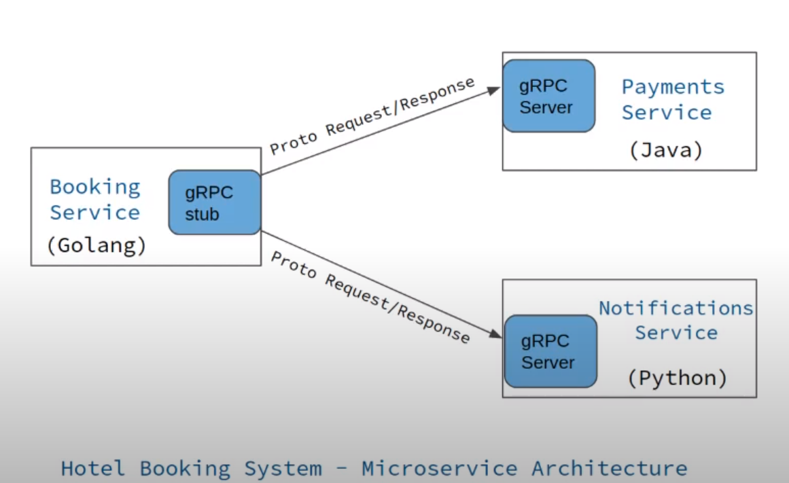

# golang-protobuf
Getting started with Protocol Buffers by Google

# what is protobuf

* Protobuf allows to define the required data structures using its IDL (int .proto files)
* Use that IDL as the source we can generate code for multiple languages (Gp, Java, Python, C++, C#,...).
* Protobuf is used by default to define messages and services in gRPC
* gRPC is a modern Remote Procedure Call (RPC) framework to connect applications using HTTP/2 and provides features such as authentication bidirectional streaming and flow control.




# install protoc

* We can download a bundle that includes multiple languages from this URL: https://github.com/protocolbuffers/protobuf/releases but not for Golang. More information on [Cross-lanuage Compatibility](https://protobuf.dev/overview/#cross-lang)
* For Go we need to install protobuf compiler using the [proto3](https://protobuf.dev/programming-guides/proto3/) version. More details you can read on [Protocol Compiler Installation](https://github.com/protocolbuffers/protobuf#protocol-compiler-installation)
* The protoc compiler use plugins for [Go support for Protocol Buffers](https://github.com/protocolbuffers/protobuf-go)

Here is the step to [install Protobuf on Ubuntu 20.04](https://gist.github.com/jambonn/1f5fffc23f97f8413372a438739c1bff)
1. sudo apt-get install autoconf automake libtool curl make g++ unzip -y
2. Download the appropriate release here:
cd ~/Downloads
(https://github.com/protocolbuffers/protobuf/releases/tag/v3.20.3 <protobuf-all-3.20.3.tar.gz)
wget https://github.com/protocolbuffers/protobuf/releases/download/v3.20.3/protobuf-all-3.20.3.tar.gz
#wget https://github.com/protocolbuffers/protobuf/releases/tag/v3.5.1 <protobuf-all-3.5.1.tar.gz
>
3. Unzip the folder
```
tar -xf protobuf-all-3.20.3.tar.gz
```
4. Enter the folder and run ./autogen.sh && ./configure && make
```
$ cd protobuf-3.20.3/
$ ./autogen.sh && ./configure && make
```
5. Then run these other commands. They should run without issues:
```
$ make check
$ sudo make install
$ which protoc
/usr/local/bin/protoc
$ sudo ldconfig
$ protoc --version
libprotoc 3.20.3
```

# init project

Init Go module
```
$ go mod init github.com/favtuts/golang-protobuf
```

Install protoc gen library for GO
```
$ cd PROJECT_ROOT
$ go get -u github.com/golang/protobuf/protoc-gen-go
go: module github.com/golang/protobuf is deprecated: Use the "google.golang.org/protobuf" module instead.
go get: installing executables with 'go get' in module mode is deprecated.
        To adjust and download dependencies of the current module, use 'go get -d'.
        To install using requirements of the current module, use 'go install'.
        To install ignoring the current module, use 'go install' with a version,
        like 'go install example.com/cmd@latest'.
        For more information, see https://golang.org/doc/go-get-install-deprecation
        or run 'go help get' or 'go help install'.
go get: added github.com/golang/protobuf v1.5.3
go get: added google.golang.org/protobuf v1.26.0
```


# create proto file

Let's create a "person.proto" file
```
syntax = "proto3";

package main;

message Person {
    string firstname = 1;
    string lastname = 2;
}
```

Then execute the command to generate the Golang code
```
$ protoc --go_out=. person.proto


protoc-gen-go: unable to determine Go import path for "person.proto"

Please specify either:
        • a "go_package" option in the .proto source file, or
        • a "M" argument on the command line.

See https://protobuf.dev/reference/go/go-generated#package for more information.

--go_out: protoc-gen-go: Plugin failed with status code 1.
```

To fix the error, let's downgrade to use protoc-gen-go@v1.3.2
```
$ go get -u github.com/golang/protobuf/protoc-gen-go@v1.3.2

go: downloading github.com/golang/protobuf v1.3.2
go: downloading google.golang.org/protobuf v1.26.0-rc.1
go: module github.com/golang/protobuf is deprecated: Use the "google.golang.org/protobuf" module instead.
go get: installing executables with 'go get' in module mode is deprecated.
        To adjust and download dependencies of the current module, use 'go get -d'.
        To install using requirements of the current module, use 'go install'.
        To install ignoring the current module, use 'go install' with a version,
        like 'go install example.com/cmd@latest'.
        For more information, see https://golang.org/doc/go-get-install-deprecation
        or run 'go help get' or 'go help install'.
go get: downgraded github.com/golang/protobuf v1.5.3 => v1.3.2
go get: downgraded google.golang.org/protobuf v1.30.0 => v1.26.0-rc.1
```

Then re-run the command again, we can see that a "person.pb.go" is generated


# update new attributes

Let's add some other attributes like age or job, and a list of friends
```
syntax = "proto3";

package main;

message Job {
    string title = 1;
    float salary = 2;
}

message Person {
    string firstname = 1;
    string lastname = 2;
    int32 age = 3;
    Job job = 4;
    repeated Person friends = 5;
}
```

Then re-generate Golang code again
```
$ protoc --go_out=. person.proto
```


# run main

Let's keep the simple proto file with firstname and lastname attributes, and re-generate Go code again
```
message Person {
    string firstname = 1;
    string lastname = 2;    
}
```

Then create new `main.go` file then we can use protobuf to serialize the `Person` struct
```
package main

import (
	"io/ioutil"
	"log"

	"github.com/golang/protobuf/proto"
)

func main() {
	person := &Person{
		Firstname: "John",
		Lastname:  "Doe",
	}

	serializedPerson, err := proto.Marshal(person)
	if err != nil {
		log.Fatal("marshalling error: ", err)
	}

	ioutil.WriteFile("person.data", serializedPerson, 0644)
}
```

Then run the program to generate the `person.data` file
```
$ go run *.go
```

We create 2 new files:`person.json` and `person.xml` and then compare the file size:
```
$ stat person.xml
  File: person.xml
  Size: 71              Blocks: 8          IO Block: 4096   regular file


$ stat person.json
  File: person.json
  Size: 40              Blocks: 8          IO Block: 4096   regular file


$ stat person.data
  File: person.data
  Size: 11              Blocks: 8          IO Block: 4096   regular file
```

You can see the data file that we serialized using protocol buffers is a lot less, the size is 11. So that the main advantages of using protocol buffers the data is binary and it's compressed automatically so we can see the difference between binary format and using JSON or XML.